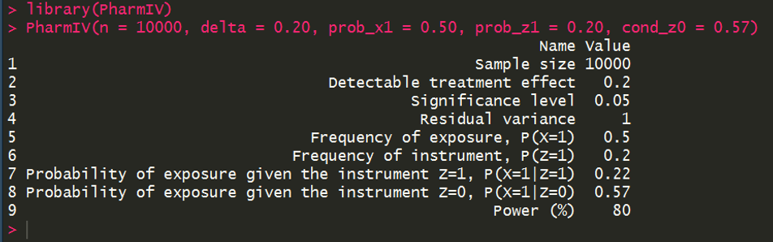
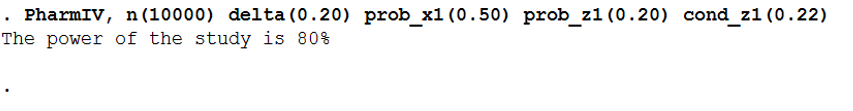

# PharmIV

This respository supplies the tools necessary to calculate the power of an instrumental variable analysis study using a single binary instrument Z to analyse the causal effect of a binary exposure X on a continuous outcome Y in the context of pharmacoepidemiology. If you use this material, please cite:

Walker VM, Davies NM, Windmeijer F, Burgess S, Martin RM. Power calculator for instrumental variable analysis in pharmacoepidemiology. Int J Epidemiol. 2017 Oct 1;46(5):1627–32. 

The simulations and plots included in this paper were produced using Stata and the code can be found in the folder 'Stata_paper'.

## Shiny

The folder 'Shiny' contains the code to produce the power calculator shiny app. The app is avaliable at:

https://venexia.shinyapps.io/PharmIV/

## R package

The folder 'R_package' contains the R package to calculate the power of an instrumental variable analysis study using a single binary instrument Z to analyse the causal effect of a binary exposure X on a continuous outcome Y. 

### Installation

The package can be installed using the following commands:

```r
install.packages("devtools")
devtools::install_github("venexia/PharmIV", subdir="R_package")
```

### Syntax

The syntax for this package is as follows:

```r
PharmIV(n = NULL, delta = NULL, alpha = 0.05, sigma = 1.00, prob_x1 = NULL, prob_z1 = NULL, cond_z1 = NULL, cond_z0 = NULL)
```

### Example

What is the power of an instrumental variable analysis study with 10,000 participants to detect a treament effect of 0.20 for a treatment with a frequency of exposure of 0.50? The binary instrument for the study has a freqency of 0.20 and the probability of exposure given the instrument Z=0 is 0.57.



## Stata package

To allow web download, the Stata package to calculate the power of an instrumental variable analysis study using a single binary instrument Z to analyse the causal effect of a binary exposure X on a continuous outcome Y is contained in its own repository 'PharmIV_Stata'. 

### Installation

```stata
net install github, from("https://haghish.github.io/github/")
github install venexia/PharmIV_Stata
```

### Syntax

The syntax for this package is as follows:

```stata
PharmIV, n(numlist) delta(numlist) alpha(numlist) sigma(numlist) prob_x1(numlist) prob_z1(numlist) cond_z1(numlist) cond_z0(numlist) 
```

### Example

What is the power of an instrumental variable analysis study with 10,000 participants to detect a treament effect of 0.20 for a treatment with a frequency of exposure of 0.50? The binary instrument for the study has a freqency of 0.20 and the probability of exposure given the instrument Z=0 is 0.57.


